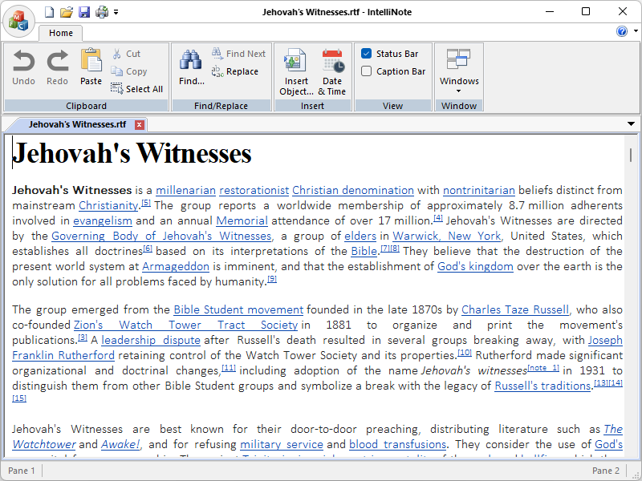

Download:
- [IntelliNoteSetup.msi](https://www.moga.doctor/freeware/IntelliNoteSetup.msi)
- [IntelliNote.zip](https://www.moga.doctor/freeware/IntelliNote.zip)

## Introduction

_IntelliNote_ is a free (as in “free speech” and also as in “free beer”) **R**ich**T**ext**F**ile editor. Running in the Microsoft Windows environment, its use is governed by [GNU General Public License v3.0](https://www.gnu.org/licenses/gpl-3.0.html). _IntelliNote_ is written in C++ and uses pure Win32 API and STL which ensures a higher execution speed and smaller program size. By optimizing as many routines as possible without losing user friendliness, _IntelliNote_ is trying to reduce the world carbon dioxide emissions. When using less CPU power, the PC can throttle down and reduce power consumption, resulting in a greener environment. I hope you enjoy _IntelliNote_ as much as I enjoy coding it!

### What is client-server application?

A client-server application is a program that runs on the client-side while accessing the information over a remote server. The client-server always makes requests to the remote server by calling functions of the server to retrieve information. The client program and the server program may run on different systems and on different platforms where they require a communications layer known as middleware.

The client-server application might run on a network client or a network server. The applications are solely described on their architecture except for the fact that how it is deployed on the network. It uses a two-tier architecture that has two users; the client and the server.

The server machine acts as a host that can run single or multiple server programs that share their resources with the clients. Sometimes the server gets overloaded when simultaneous requests are received from the client.

The communication between the client and server is a two-way street. Servers can reach the client to make sure that the client has appropriate updates, patches, or if there are any other requirements. Once the inquiry is done, the server closes the connection to the client so that the bandwidth space and the network are conserved.

### Features of client-server application

Some of the typical features of client-server applications are as follows:

- Multiple client programs have the ability to request services from a single server;
- A single client program can request services from multiple server programs;
- A single server program has the ability to provide multiple services;
- The client program doesn’t have to be aware of the number of subprograms that provide a service;
- Multiple subprograms have the ability to work together to provide a service;
- The server programs run on a machine that is remote from the machine that runs the client program.

## Getting started

### Install IntelliNote using the installer

- Download the installer
- Run the executable binary and follow the installation flow

The installer will likely require Administrative privileges in order to install _IntelliNote_ (and later, to update _IntelliNote_ or install or update plugins, or anything else that requires writing to the installation directory). If you do not have Administrative privileges, you either need to tell the installer to use a location where you do have write permission (though that may still ask for Administrator privileges), or you may choose not use the installer and instead run a portable edition from a directory where you have write permission.

### Install IntelliNote from zip

These instructions will allow you to run a portable or mini-portable (also called “minimalist”), without requiring administrative privileges.

- Create a new folder somewhere that you have write-permission
- Unzip the content into the new folder
- Run _IntelliNote_ from the new folder

The portable zip edition of _IntelliNote_ can be removed by deleting the directory they came in. If you manually set up file associations or context-menu entries in the OS, it is your responsibility to remove them yourself.

## Create and Submit your Pull Request

As noted in the [Contributing Rules](https://github.com/mihaimoga/IntelliNote/blob/main/CONTRIBUTING.md) for _IntelliNote_, all Pull Requests need to be attached to a issue on GitHub. So the first step is to create an issue which requests that the functionality be improved (if it was already there) or added (if it was not yet there); in your issue, be sure to explain that you have the functionality definition ready, and will be submitting a Pull Request. The second step is to use the GitHub interface to create the Pull Request from your fork into the main repository. The final step is to wait for and respond to feedback from the developers as needed, until such time as your PR is accepted or rejected.

## Acknowledges

This open source project uses the following libraries:

- Stefan-Mihai MOGA's [genUp4win](https://github.com/mihaimoga/genUp4win)
- PJ Naughter's [CHLinkCtrl](https://www.naughter.com/hlinkctrl.html)
- PJ Naughter's [CInstanceChecker](https://www.naughter.com/sinstance.html)
- PJ Naughter's [CVersionInfo](https://www.naughter.com/versioninfo.html)
